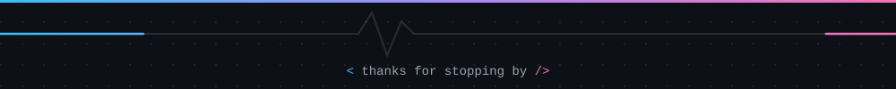

  

  

  
  
  

 

## About

Software Engineering graduate who builds mobile apps and the backend systems behind them. I create Flutter applications with clean architecture and scalable state management, and design Spring Boot services with caching, messaging and asynchronous processing. I enjoy working in international, fast-paced teams and communicate comfortably in English.

<table>
  <tr>
    <td>🎓 <b>Education</b></td>
    <td>B.Sc. Software Engineering, Burdur Mehmet Akif Ersoy University (2022–2026) · GPA 3.17 / 4.00</td>
  </tr>
  <tr>
    <td>📱 <b>Mobile</b></td>
    <td>Flutter, Dart, Clean Architecture, BLoC/Cubit, Riverpod</td>
  </tr>
  <tr>
    <td>⚙️ <b>Backend</b></td>
    <td>Java, Spring Boot, Redis, Kafka, RabbitMQ, PostgreSQL</td>
  </tr>
  <tr>
    <td>🌱 <b>Exploring</b></td>
    <td>Native Android with Kotlin and Jetpack Compose</td>
  </tr>
  <tr>
    <td>📍 <b>Location</b></td>
    <td>İzmir, Türkiye</td>
  </tr>
</table>

 

## Tech Stack

<table>
  <tr>
    <td align="center" width="160"><b>Mobile</b></td>
    <td></td>
  </tr>
  <tr>
    <td align="center"><b>Backend</b></td>
    <td></td>
  </tr>
  <tr>
    <td align="center"><b>Databases</b></td>
    <td></td>
  </tr>
  <tr>
    <td align="center"><b>DevOps & Tools</b></td>
    <td></td>
  </tr>
  <tr>
    <td align="center"><b>Other Languages</b></td>
    <td></td>
  </tr>
</table>

 

## What I Work With

- **Mobile:** Clean Architecture, BLoC/Cubit, Riverpod, REST API integration
- **Backend:** Layered Spring Boot services, Spring Data JPA, Flyway migrations, validation, global error handling
- **Caching:** Redis
- **Messaging:** Kafka and RabbitMQ for event-driven and background processing
- **Quality:** JUnit, Testcontainers, GitHub Actions CI

 

## Featured Project

**RAG Document Assistant**: Spring Boot · PostgreSQL + pgvector · Ollama · Docker

Users upload documents that are parsed, chunked and embedded in the background. Questions are then answered from their own documents, with cited sources.

[View repository →](https://github.com/OzlemBalikci/REPO-ADI)

 

## GitHub Stats

  
  

  

 

## Contact

📧 balikciozlem.381@gmail.com  ·  💼 [LinkedIn](https://www.linkedin.com/in/ozlembalikci/)

  

